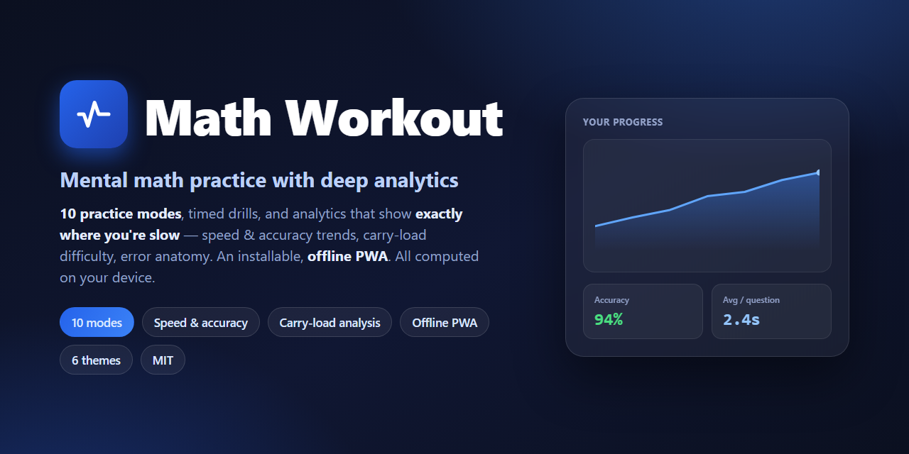
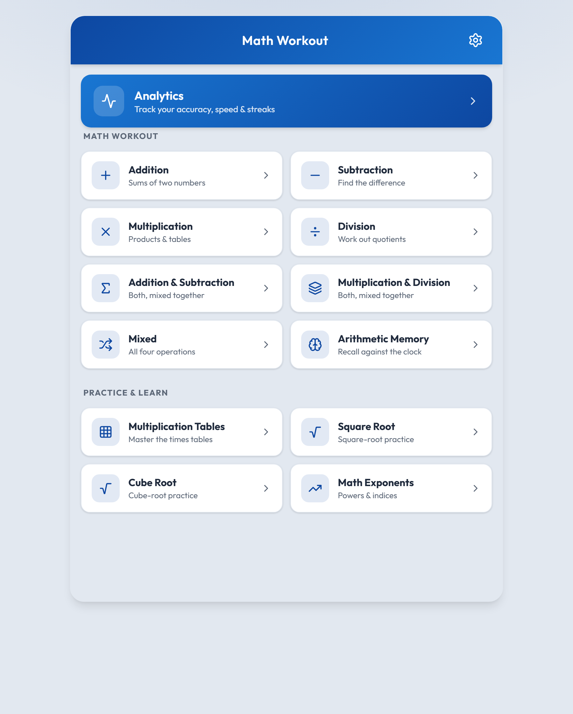

<p align="center">
  
</p>

<h1 align="center">Math Workout</h1>

<p align="center">
  <b>A fast, offline mental-math trainer with deep practice analytics.</b><br>
  Ten practice modes, six themes, installable PWA — and every stat is computed on your device.
</p>

<p align="center">
  <a href="https://kkhub.vercel.app/math"><b>▶ Live demo</b></a> ·
  <a href="#features">Features</a> ·
  <a href="#analytics">Analytics</a> ·
  <a href="#getting-started">Getting started</a> ·
  <a href="#privacy">Privacy</a>
</p>

---

Math Workout generates mathematically sound problems across addition, subtraction, multiplication,
division, roots and exponents, times you against the clock, and then shows you **exactly where you're
slow and what trips you up** — speed trends, accuracy, carry-load difficulty and per-question error
anatomy. It's a **PWA**: install it, and it works fully offline.

<p align="center">
  
</p>

## Features

- **10 practice modes** — Addition, Subtraction, Multiplication, Division, mixed sets, **Arithmetic Memory**,
  **Multiplication Tables**, **Square Root**, **Cube Root** and **Exponents**.
- **Difficulty levels** that scale the numbers sensibly for each mode.
- **Time vs. question limits** — race a 60-second clock or complete a fixed set.
- **Multiplication Tables module** — drill only the tables you choose (e.g. just the 13× and 14×).
- **Learn mode** — step-by-step methods for the trickier modes.
- **Six themes** (light, dark, forest, sunset, purple, nothing-light), responsive and mobile-first.
- **Installable PWA** — offline-capable via a service worker; add it to your home screen.
- **Backup & restore** — export/import your entire history as a single JSON file.

## Analytics

The part that makes it more than a quiz. Everything below is computed **on your device** from your saved
history, with charts powered by Chart.js:

- **Speed & accuracy trends** over time (rolling median, first-attempt rate).
- **Carry-load difficulty** — how much harder carries/borrows make a question for *you*.
- **Error anatomy** — which columns (units, tens, …) and magnitudes you miss most.
- **Most-missed & slowest questions**, attempts distribution, per-day activity, and more.

## Privacy

**100% local.** No account, no backend, no analytics beacon. Your practice history lives only in your
browser's `localStorage`, and the backup file stays on your machine. Nothing is ever uploaded.

## Getting started

Requires Node 18+.

```bash
git clone https://github.com/kktheglider/MathWorkout.git
cd MathWorkout
npm install
npm run dev        # http://localhost:5173
```

Build for production:

```bash
npm run build      # outputs to dist/
npm run preview    # preview the production build
```

## Deploy

It's a static Vite build — deploy `dist/` to **any** static host (Vercel, Netlify, GitHub Pages,
Cloudflare Pages, S3). It's configured to serve from the **root** by default. To host it under a
sub-path (e.g. `example.com/math/`), set `base: '/math/'` in `vite.config.js` — the router and service
worker read the same base automatically.

## Tech stack

**React 19** · **Vite 8** · **React Router 7** · **Chart.js** / react-chartjs-2 · **lucide-react** ·
oxlint. No backend, no database — a pure client-side app.

## License

MIT — see [LICENSE](LICENSE).
